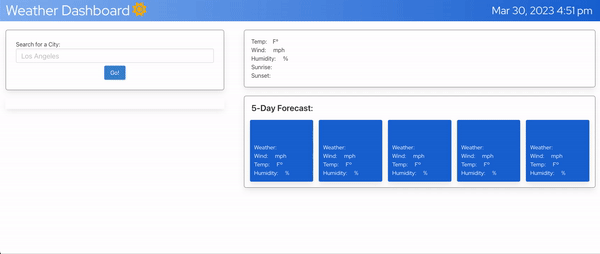

# WeatherApi

## Discription

This is a weather dashboard that displays current weather and a five-day forecast. It has a city search input and will save previous searches in a container element below. The nav bar displays the current time and date.

## Usage

The user should type in the city name they're looking for in the search box (ex. Seattle). After clicking on the, "Go!" button, the target cities' information will populate in the current weather box and the five day forecast below that.

## Screenshots

## Deployed URL

https://ehmahdee.github.io/WeatherApi/

## Credit

Credit to Patricia Alberto, Michael Huang, Michael Rader, Shawn Tschoepe, and the UCLA Bootcamp Discord for all the debugging and planning help!

## License

Refer to the GitHub license.